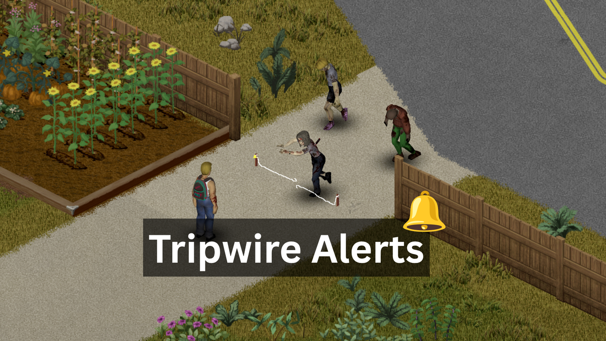
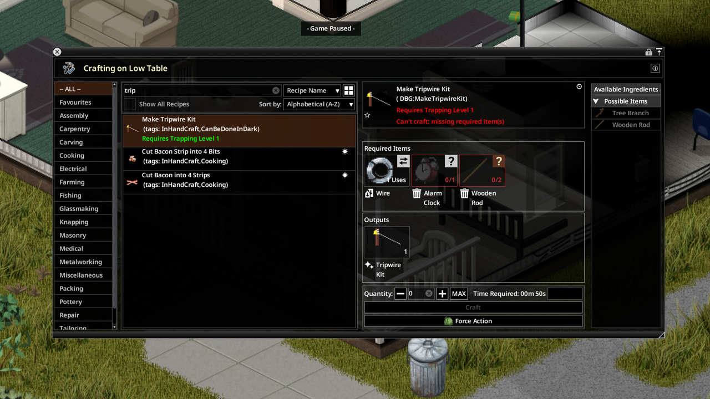
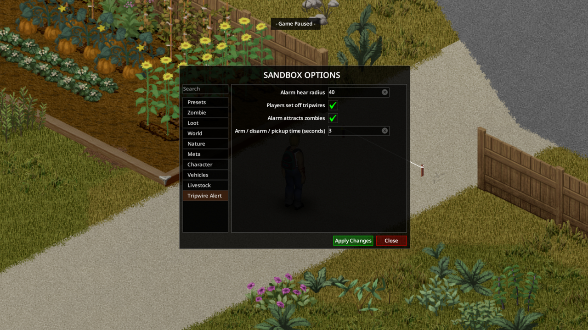

# Project Zomboid mod: TripwireAlert!

First mod I ever created to a game after having a discussion with my friend and the way his character died in the game by not hearing a zombie crawling up behind him while he was busy doing other stuff. 

Got inspired and created this mod for fun.

Thanks & Enjoy.

## How to use in single-player

Copy the `TripwireAlert/` fodler into your mods fodler in `C:\Users\<USER>\Zomboid\Workshop`

## Workshop mod description

Place a bell tripwire and when something walks through, a bell rings and alerts you of incoming danger but be careful, nearby zombies can hear it too.

### Crafting:

Tripwire Kit (Trapping 1), either:
- 1 Wire, 1 Alarm Clock, 1 Wooden Stick or Tree Branch. No tools.
- 1 Wire, 1 Bell, 2 Long Sticks. No tools.

### How it works:

1. Right-click the kit and choose Place.
2. Click a start tile, then an end tile (1 to 3 tiles, same floor, no walls in the way).
3. The wire is armed when you place it.
4. Zombies, animals, vehicles and even players can snap it.

After the wire snaps: Repair with 1 Wire, or spend 1 Wire to pick up the kit. Arm and disarm from the world menu.

***WARNING**: You get a grace period before you can trigger the trip wire. If you want to pass without breaking the line you need to crouch/stealth.*

### Sandbox options:

- Bell ring radius: how far zombies can hear the bell.
- Bell volume: how loud the bell is for you (0 silent, 100 full).
- Players set off tripwires: walking onto an armed wire rings it. Crouch/stealth to pass without breaking the line.
- Animals set off tripwires: turn off if livestock or wildlife keep setting it off.
- Bell ring attracts zombies: if off, you still hear the bell but zombies ignore it.
- Arm / disarm / pickup time.

### Notes:

Build 42.20+ Works in singleplayer, multiplayer is not tested yet but should work

Workshop ID: 3795603594
Mod ID: TripwireAlert

